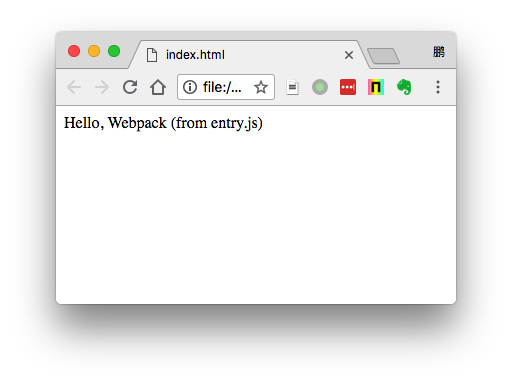

JavaScript Webpack Exclude External Dependencies Demo
=====================================================

在Webpack打包时，可以通过`externals`声明哪些是外部依赖，这样在打包时，会把它们排除在外。

同时，在html页面中，我们需要手动加入这些外部库的引用才行。

```
npm install
npm run demo
open index.html
```

